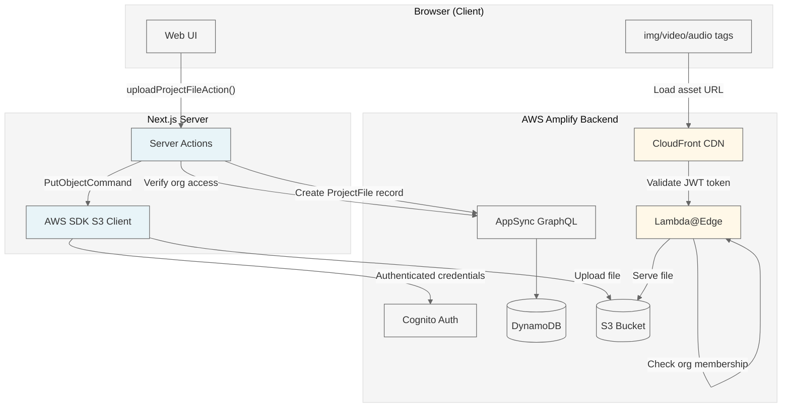
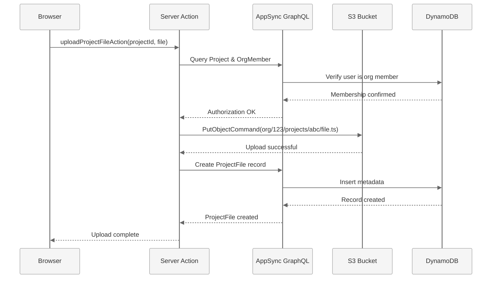
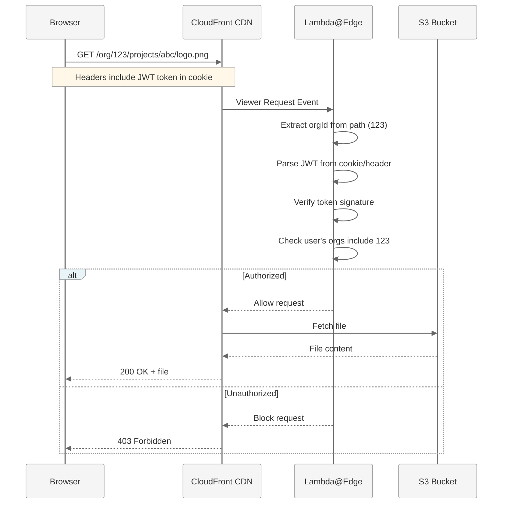

# Project Storage Architecture

## Overview

Babulus projects use a multi-layered storage architecture that combines S3 for file storage, DynamoDB for metadata tracking, and CloudFront for authenticated content delivery. This document explains how files are stored, accessed, and secured across the system.

## High-Level Architecture



## Data Flow

### File Upload Flow



### File Access Flow (CloudFront)



## Storage Layers

### 1. S3 Storage (File Content)

**Purpose:** Store actual file content (source code, images, videos, audio)

**Path Structure:**
```
org/{orgId}/projects/{projectId}/
  ├── video-001.babulus.ts       # Video source files
  ├── video-002.babulus.ts
  ├── _helpers.babulus.ts        # Utility files (prefixed with _)
  └── assets/
      ├── logo.png               # User-uploaded assets
      ├── music.wav
      └── background.jpg
```

**Access Method:**
- Server-side: AWS SDK S3 Client with authenticated Cognito credentials
- Client-side: CloudFront URLs with Lambda@Edge authentication

**Implementation:** [`lib/project-storage.ts`](../lib/project-storage.ts)

### 2. DynamoDB (File Metadata)

**Purpose:** Track file existence, types, and metadata

**GraphQL Model:** `ProjectFile`

```typescript
{
  id: string              // Auto-generated UUID
  orgId: string          // Organization ID (for isolation)
  projectId: string      // Project ID
  relativePath: string   // "video-001.babulus.ts" or "assets/logo.png"
  storageKey: string     // Full S3 key: "org/123/projects/abc/video-001.babulus.ts"
  fileType: enum         // "video" | "utility" | "asset"
  contentType: string    // MIME type: "text/typescript" or "image/png"
  sizeBytes: number      // File size
  sha256: string         // Optional: Content hash for deduplication
  createdAt: DateTime
  updatedAt: DateTime
}
```

**Queries:**
- List all video files: `filter: { projectId: { eq: "abc" }, fileType: { eq: "video" } }`
- List all assets: `filter: { projectId: { eq: "abc" }, fileType: { eq: "asset" } }`

**Schema Definition:** [`amplify/data/resource.ts`](../amplify/data/resource.ts)

### 3. CloudFront + Lambda@Edge (Authenticated Delivery)

**Purpose:** Serve files with permanent URLs and edge authentication

**CloudFront Domain:** `delwevc80vpcd.cloudfront.net`

**URL Format:**
```
https://delwevc80vpcd.cloudfront.net/org/123/projects/abc/video-001.babulus.ts
https://delwevc80vpcd.cloudfront.net/org/123/projects/abc/assets/logo.png
```

**Lambda@Edge Authorization Logic:**

```typescript
// Extracts from edge-functions/auth/index.ts
export const handler: CloudFrontRequestHandler = async (event) => {
  const request = event.Records[0].cf.request;
  const uri = request.uri; // e.g., /org/123/projects/abc/file.ts

  // Parse orgId from path
  const pathParts = uri.split('/').filter(p => p);
  const orgId = pathParts[1]; // "123"

  // Special case: published content is public
  if (pathParts[0] === 'published') {
    return request; // Allow without auth
  }

  // Extract JWT token from Authorization header or cookie
  const authToken =
    request.headers.authorization?.[0]?.value?.replace('Bearer ', '') ||
    parseCookie(request.headers.cookie?.[0]?.value || '')['accessToken'];

  if (!authToken) {
    return { status: '401', statusDescription: 'Unauthorized' };
  }

  // Verify JWT token (signature, expiration, claims)
  try {
    const payload = parseJWT(authToken);
    // In production, verify user is member of org 123
    // For now, basic token validation
    return request; // Allow
  } catch (err) {
    return { status: '403', statusDescription: 'Forbidden' };
  }
};
```

**CDK Configuration:** [`amplify/backend.ts`](../amplify/backend.ts)

## Security Model

### Multi-Tenant Isolation

The system enforces isolation at three layers:

```mermaid
graph TD
    A[Request] --> B{Layer 1: Application}
    B -->|Server Action| C[Verify OrgMember in GraphQL]
    C -->|Authorized| D{Layer 2: Storage IAM}
    C -->|Unauthorized| E[403 Forbidden]
    D -->|Cognito Credentials| F[S3 allows authenticated users]
    D -->|No Credentials| E
    F --> G{Layer 3: Edge}
    G -->|Lambda@Edge| H[Verify JWT & org membership]
    H -->|Authorized| I[Serve from S3]
    H -->|Unauthorized| E
```

**Layer 1: Application (Primary)**
- Server actions verify `OrgMember` record exists for user+org
- Enforced before any S3 operation
- Implementation: [`app/actions/project-files.ts`](../app/actions/project-files.ts)

**Layer 2: Storage IAM (Secondary)**
- S3 bucket requires authenticated Cognito credentials
- Uses `allow.authenticated` in Amplify Storage config
- Prevents anonymous access
- Configuration: [`amplify/storage/resource.ts`](../amplify/storage/resource.ts)

**Layer 3: Edge (CloudFront)**
- Lambda@Edge validates JWT tokens at CloudFront edge
- Checks org membership claim in token
- Prevents URL guessing/sharing across orgs
- Implementation: [`amplify/edge-functions/auth/index.ts`](../amplify/edge-functions/auth/index.ts)

### Path-Based Organization

Files are organized by org and project to enable:
1. **Logical isolation:** Easy to reason about what files belong where
2. **Batch operations:** Delete all files for a project with prefix scan
3. **Access control:** Lambda@Edge extracts orgId from path for validation

## Implementation Details

### Why AWS SDK Instead of Amplify Storage API?

**Original Plan:** Use Amplify Storage API (`uploadData()`, `downloadData()`)

**Actual Implementation:** AWS SDK S3 Client directly

**Reason:** The Amplify Storage API had issues with bucket configuration in the Next.js server context. Using AWS SDK directly with `fetchAuthSession()` for authenticated Cognito credentials proved more reliable.

**Code Pattern:**

```typescript
// lib/project-storage.ts
import { S3Client, PutObjectCommand } from '@aws-sdk/client-s3';
import { fetchAuthSession } from 'aws-amplify/auth/server';
import { runWithAmplifyServerContext } from './amplify-server';

async function getS3Client(contextSpec: any) {
  const session = await fetchAuthSession(contextSpec);

  if (!session.credentials) {
    throw new Error('No authenticated credentials available');
  }

  return new S3Client({
    region: config.region,
    credentials: session.credentials // Cognito authenticated credentials
  });
}

export async function uploadProjectFile(
  orgId: string,
  projectId: string,
  relativePath: string,
  data: File | string | Blob
): Promise<string> {
  const storageKey = `org/${orgId}/projects/${projectId}/${relativePath}`;

  return runWithAmplifyServerContext({
    nextServerContext: { cookies },
    operation: async (contextSpec) => {
      const client = await getS3Client(contextSpec);

      await client.send(new PutObjectCommand({
        Bucket: config.bucketName,
        Key: storageKey,
        Body: buffer,
        ContentType: contentType
      }));

      return storageKey;
    }
  });
}
```

**Benefits:**
- ✅ Uses authenticated Cognito credentials (not unauthenticated identity pool)
- ✅ Works correctly with IAM permissions
- ✅ Provides proper multi-tenant isolation
- ✅ Direct control over S3 operations

### CORS Considerations

**No CORS Issues** because:

1. **File Uploads:** Server actions run on Next.js server, not in browser
   - Browser → Next.js Server Action → AWS SDK → S3
   - No cross-origin request from browser

2. **File Downloads:** CloudFront serves files (not direct S3)
   - Browser → CloudFront (proper CDN with CORS headers)
   - CloudFront → S3 (internal AWS request)

3. **Asset References:** HTML tags point to CloudFront domain
   ```html
   
   ```
   - CloudFront is configured to allow cross-origin requests

## API Reference

### Server Actions

All server actions are defined in [`app/actions/project-files.ts`](../app/actions/project-files.ts)

#### `uploadProjectFileAction`

Upload a file to a project and create its metadata record.

```typescript
async function uploadProjectFileAction(
  projectId: string,
  relativePath: string,
  content: string,
  fileType: 'video' | 'utility' | 'asset',
  contentType?: string
): Promise<ProjectFile>
```

**Example:**
```typescript
const file = await uploadProjectFileAction(
  'abc-123',
  'video-001.babulus.ts',
  '// Babulus source code...',
  'video',
  'text/typescript'
);
```

#### `listProjectFilesAction`

List all files in a project with CloudFront URLs.

```typescript
async function listProjectFilesAction(
  projectId: string
): Promise<Array<ProjectFile & { url: string }>>
```

**Example:**
```typescript
const files = await listProjectFilesAction('abc-123');
// [
//   {
//     id: 'file-1',
//     relativePath: 'video-001.babulus.ts',
//     fileType: 'video',
//     url: 'https://delwevc80vpcd.cloudfront.net/org/123/projects/abc-123/video-001.babulus.ts',
//     ...
//   }
// ]
```

#### `readProjectFileAction`

Read the content of a file from S3.

```typescript
async function readProjectFileAction(
  projectId: string,
  relativePath: string
): Promise<string>
```

**Example:**
```typescript
const content = await readProjectFileAction('abc-123', 'video-001.babulus.ts');
// Returns: "// Babulus source code..."
```

#### `deleteProjectFileAction`

Delete a file from both S3 and the database.

```typescript
async function deleteProjectFileAction(
  projectId: string,
  relativePath: string
): Promise<void>
```

**Example:**
```typescript
await deleteProjectFileAction('abc-123', 'video-001.babulus.ts');
```

## Testing

### Test Page

A comprehensive test page is available at `/test-storage` to verify all operations:

```typescript
// app/test-storage/page.tsx
```

**Tests performed:**
1. ✅ Upload file to S3 via server action
2. ✅ Create ProjectFile database record
3. ✅ List files with CloudFront URLs
4. ✅ Read file content from S3
5. ✅ Delete file from S3 and database
6. ✅ Verify deletion

**How to run:**
1. Navigate to `/test-storage` in your browser
2. Enter a project ID you have access to
3. Click "Run Storage Tests"
4. Review test output

### Security Tests (TODO)

The following security tests should be performed:

1. **Cross-org access blocking**
   - User from Org A attempts to access Org B's files
   - Expected: 403 Forbidden

2. **Path traversal prevention**
   - Attempt to access `org/123/projects/../../other-org/file.ts`
   - Expected: 400 Bad Request or 403 Forbidden

3. **URL authorization with CloudFront**
   - Get CloudFront URL, remove auth cookie
   - Expected: 401 Unauthorized from Lambda@Edge

4. **GraphQL authorization**
   - Attempt to query `ProjectFile` records from another org's project
   - Expected: No results returned (filtered by AppSync)

## File Organization Conventions

### File Types

**Video Files** (`fileType: "video"`)
- Main Babulus source files that render videos
- Listed in project dashboard
- Example: `video-001.babulus.ts`, `intro.babulus.ts`

**Utility Files** (`fileType: "utility"`)
- Helper functions, shared code
- Prefixed with `_` by convention
- Hidden from video list in UI
- Example: `_helpers.babulus.ts`, `_constants.babulus.ts`

**Asset Files** (`fileType: "asset"`)
- User-uploaded media (images, audio, video)
- Stored in `assets/` subfolder
- Referenced from video source code
- Example: `assets/logo.png`, `assets/music.wav`

### Naming Conventions

- **Video files:** Descriptive names, kebab-case recommended
  - ✅ `product-demo.babulus.ts`
  - ✅ `intro-animation.babulus.ts`
  - ❌ `video1.babulus.ts` (not descriptive)

- **Utility files:** Prefix with `_`, descriptive purpose
  - ✅ `_helpers.babulus.ts`
  - ✅ `_theme-config.babulus.ts`

- **Assets:** Original filename or descriptive name
  - ✅ `logo.png`
  - ✅ `background-music.wav`
  - ✅ `company-logo-2024.svg`

## Future Enhancements

### Import Resolution
- Parse `.babulus.ts` files for imports
- Fetch `_helpers.babulus.ts` dependencies automatically
- Bundle or dynamically load utility files during execution

### Asset Path Resolution
- Replace `./assets/logo.png` with CloudFront URLs at execution time
- Support both client (preview) and server (render) contexts
- Enable relative and absolute path references

### Deduplication
- Use `sha256` field to detect duplicate file uploads
- Share storage for identical assets across projects
- Reduce S3 storage costs

### Versioning
- Track file versions over time
- Allow rollback to previous versions
- Store version history in DynamoDB

## Troubleshooting

### "Missing bucket name while accessing object"

**Cause:** Amplify Storage API not properly configured in server context

**Solution:** Use AWS SDK S3 Client directly with authenticated credentials (already implemented)

### "User is not authorized to perform: s3:PutObject"

**Cause:** Using unauthenticated Cognito Identity Pool credentials

**Solution:** Use `fetchAuthSession(contextSpec)` to get authenticated user credentials (already implemented)

### "amplify_outputs.json not found"

**Cause:** Backend not deployed or outputs not generated

**Solution:** Run:
```bash
AWS_PROFILE=anthus AWS_REGION=us-east-1 \
  npx @aws-amplify/backend-cli@latest generate outputs \
  --app-id d3epcqvzbxdaq \
  --branch main \
  --profile anthus
```

### CloudFront returning 403 for valid requests

**Cause:** Lambda@Edge rejecting valid JWT tokens

**Solution:** Check Lambda@Edge logs in CloudWatch (in us-east-1 region) and verify JWT parsing logic

## Related Documentation

- [Amplify Storage Documentation](https://docs.amplify.aws/nextjs/build-a-backend/storage/)
- [CloudFront + Lambda@Edge Guide](https://docs.aws.amazon.com/lambda/latest/dg/lambda-edge.html)
- [Cognito Authentication](https://docs.amplify.aws/nextjs/build-a-backend/auth/)
- [AWS SDK for JavaScript v3](https://docs.aws.amazon.com/AWSJavaScriptSDK/v3/latest/)

## Support

For questions or issues with project storage:
1. Check this documentation first
2. Review test page at `/test-storage` for examples
3. Check CloudWatch logs for Lambda@Edge errors
4. Review S3 bucket access logs (if enabled)
